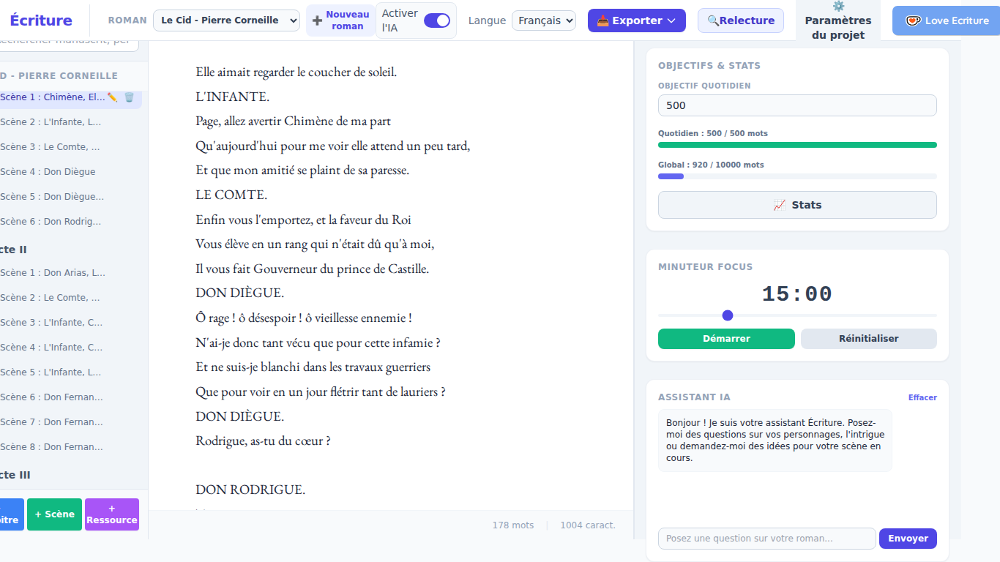

# Écriture

Écriture est une application de traitement de texte conçue spécifiquement pour les auteurs et les écrivains, intégrant des fonctionnalités d'assistance par intelligence artificielle, de gestion de projet littéraire, et d'outils linguistiques pour vous aider à rédiger votre prochain roman.

Ce projet est la version refaite en Rust (avec Tauri pour le frontend) de l'application originale écrite en Python, offrant ainsi de meilleures performances et une empreinte mémoire réduite.

## Fonctionnalités Principales

- **Gestion de Projet Littéraire :** Créez, chargez et sauvegardez vos projets de romans. Gérez la structure de votre manuscrit (chapitres et scènes), vos personnages, l'intrigue et vos notes.
- **Éditeur de Texte Avancé :** Éditeur avec défilement continu, formatage de texte riche (Gras, Italique, Petites Majuscules), sauts de page visuels, et comptage de mots en temps réel.
- **Assistant IA Intégré :** Aide à la réécriture, développement de texte, changements de point de vue, et génération de descriptions via une IA locale (support des modèles Hugging Face/Transformers).
- **Suivi des Objectifs :** Définissez et suivez vos objectifs quotidiens et globaux d'écriture.
- **Grille d'Intrigue :** Visualisez votre histoire sous forme de timeline ou de grille avec des cartes d'intrigue.
- **Outils Linguistiques :** Recherche de synonymes intégrée (pour le français et l'anglais) et support pour les outils NLP (Natural Language Processing).
- **Exportation et Sauvegarde :** Exportez votre document vers de multiples formats (DOCX, PDF, EPUB, MOBI, ODT, TXT) et gérez vos sauvegardes locales (ZIP).

## Captures d'écran

### Interface Principale (Français)


### Mode Verrouillé / Concentration


### Grille d'Intrigue


### Timeline


## Installation

### Prérequis

1. **Rust & Cargo :** Vous devez avoir Rust installé sur votre système. Vous pouvez l'installer via [rustup](https://rustup.rs/).
2. **Node.js & npm :** Assurez-vous d'avoir Node.js installé. Vous pouvez le télécharger depuis [nodejs.org](https://nodejs.org/).
3. **Prérequis Tauri :** Suivez le guide officiel de Tauri pour installer les dépendances système nécessaires à la compilation (spécifique à Windows, macOS, ou Linux) : [Tauri Prerequisites](https://tauri.app/v1/guides/getting-started/prerequisites).

### Étapes d'installation

1. **Cloner le dépôt :**
   ```bash
   git clone <votre-url-de-depot>
   cd ecriture
   ```

2. **Se déplacer dans le dossier du projet Rust/Tauri :**
   ```bash
   cd ecriture-rust
   ```

3. **Installer les dépendances Frontend :**
   ```bash
   npm install
   ```

4. **Lancer l'application en mode Développement :**
   Cette commande va démarrer le serveur de développement Vite (frontend) et compiler/exécuter l'application Tauri (backend Rust).
   ```bash
   npm run tauri dev
   ```

5. **Compiler l'application pour la Production :**
   Une fois que vous souhaitez créer un exécutable autonome, utilisez la commande suivante :
   ```bash
   npm run tauri build
   ```
   L'exécutable généré se trouvera dans `ecriture-rust/src-tauri/target/release/`.

## Architecture du Projet

Le projet `ecriture-rust` est construit avec :
- **Frontend :** HTML5, Tailwind CSS, Vanilla TypeScript, packagé avec Vite.
- **Backend :** Rust avec le framework Tauri, offrant la communication (IPC) avec le frontend.

Le modèle de données utilise un format de fichier JSON pour stocker l'intégralité du roman (paramètres, manuscrit, intrigue, personnages, notes).

## État de la migration du backend

Le backend Rust est réparti en deux crates sous `ecriture-rust/` :

- **`ecriture-core`** — la logique métier, indépendante de Tauri, entièrement
  couverte par des tests unitaires et d'intégration : persistance des
  projets et édition de l'arbre du manuscrit, export txt/docx/pdf/odt/epub/mobi,
  recherche de synonymes en français (base `lexique.db` embarquée),
  sauvegardes locales au format JSON, chaînes de traduction, gabarits de
  prompts IA + réponses de secours hors-ligne, et comparaison de versions
  pour la mise à jour.
- **`src-tauri`** — de fines commandes `#[tauri::command]` qui appellent
  `ecriture-core`, exposées au frontend via `window.__TAURI__`.

Lancez `cargo test` dans `ecriture-rust/ecriture-core` pour exécuter la
suite complète de tests de non-régression/qualité/vérification des
fonctionnalités (plus de 60 tests, dont un test de non-régression sur la
vraie base `lexique.db`). Lancez `cargo clippy` dans chaque crate pour les
vérifications de qualité de code.

**Limites connues par rapport à l'application Python d'origine** (suivies
comme travail futur, jamais simulées silencieusement) :
- Aucun moteur d'inférence IA local n'est embarqué. Les outils IA
  contextuels (décrire, réécrire, développer, relecture, chat) renvoient
  le même texte de secours « simulé » que l'application Python affiche
  quand aucun modèle local n'est installé. Un vrai moteur peut être branché
  via le trait `ecriture_core::ai::AiBackend`.
- La recherche de synonymes ne dispose de vraies données qu'en français.
  L'application Python utilisait en plus NLTK WordNet + spaCy pour
  l'anglais, l'espagnol et le russe ; il n'existe pas d'équivalent pur Rust,
  donc ces langues renvoient une liste vide plutôt que de simuler un résultat.
- Les intégrations natives nécessitant des plugins Tauri supplémentaires
  (sélecteur de dossier pour les sauvegardes, import de documents
  `.docx`/`.odt`/`.epub`, chat IA en streaming, téléchargement de mise à
  jour) ne sont pas encore branchées.

> *Note : Pour la version anglaise de ce README, veuillez consulter [README.md](README.md).*
