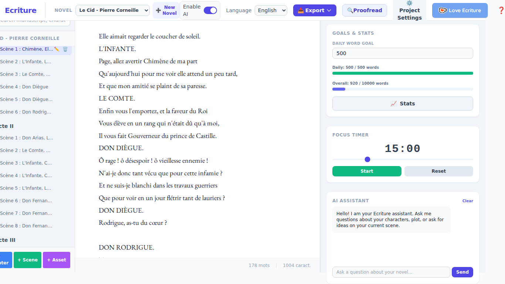

# Écriture

Écriture is a word processing application designed specifically for authors and writers. It integrates Artificial Intelligence assistance, literary project management features, and linguistic tools to help you write your next novel.

This project is a Rust port (using Tauri for the frontend) of the original application written in Python, offering better performance and a smaller memory footprint.

## Main Features

- **Literary Project Management:** Create, load, and save your novel projects. Manage the structure of your manuscript (chapters and scenes), your characters, the plot, and your notes.
- **Advanced Text Editor:** Continuous scroll editor, rich text formatting (Bold, Italic, Small Caps), visual page breaks, and real-time word counting.
- **Integrated AI Assistant:** Help with rewriting, text expansion, POV shifts, and description generation via a local AI (supporting Hugging Face/Transformers models).
- **Goal Tracking:** Set and track your daily and overall writing goals.
- **Plot Grid:** Visualize your story as a timeline or a grid with plot cards.
- **Linguistic Tools:** Integrated synonym search (for French and English) and support for NLP (Natural Language Processing) tools.
- **Export & Backup:** Export your document to multiple formats (DOCX, PDF, EPUB, MOBI, ODT, TXT) and manage local (ZIP) backups.

## Screenshots

### Main Interface (English)


### Locked / Focus Mode


### Plot Grid


### Timeline


## Installation

### Prerequisites

1. **Rust & Cargo:** You must have Rust installed on your system. You can install it via [rustup](https://rustup.rs/).
2. **Node.js & npm:** Make sure you have Node.js installed. You can download it from [nodejs.org](https://nodejs.org/).
3. **Tauri Prerequisites:** Follow the official Tauri guide to install the system dependencies required for compilation (specific to Windows, macOS, or Linux): [Tauri Prerequisites](https://tauri.app/v1/guides/getting-started/prerequisites).

### Installation Steps

1. **Clone the repository:**
   ```bash
   git clone <your-repository-url>
   cd ecriture
   ```

2. **Navigate to the Rust/Tauri project folder:**
   ```bash
   cd ecriture-rust
   ```

3. **Install Frontend Dependencies:**
   ```bash
   npm install
   ```

4. **Run the application in Development Mode:**
   This command will start the Vite development server (frontend) and compile/run the Tauri application (Rust backend).
   ```bash
   npm run tauri dev
   ```

5. **Build the application for Production:**
   When you want to create a standalone executable, use the following command:
   ```bash
   npm run tauri build
   ```
   The generated executable will be located in `ecriture-rust/src-tauri/target/release/`.

## Project Architecture

The `ecriture-rust` project is built with:
- **Frontend:** HTML5, Tailwind CSS, Vanilla TypeScript, bundled with Vite.
- **Backend:** Rust with the Tauri framework, providing communication (IPC) with the frontend.

The data model uses a JSON file format to store the entire novel (settings, manuscript, plot, characters, notes).

## Backend Migration Status

The Rust backend lives in two crates under `ecriture-rust/`:

- **`ecriture-core`** — framework-agnostic business logic (no Tauri
  dependency), fully covered by unit and integration tests:
  project persistence and manuscript tree editing, export to
  txt/docx/pdf/odt/epub/mobi, French synonym lookup (bundled `lexique.db`),
  local JSON backups, locale strings, AI prompt templates + offline
  fallback responses, and update-check version comparison.
- **`src-tauri`** — thin `#[tauri::command]` adapters over `ecriture-core`,
  exposed to the frontend via `window.__TAURI__`.

Run `cargo test` inside `ecriture-rust/ecriture-core` to run the full
regression/quality/feature-verification suite (60+ tests, including a
non-regression test against the real `lexique.db`). Run `cargo clippy` in
either crate for lint/quality checks.

### Local AI (Gemma)

Contextual AI tools (describe/rewrite/expand/POV/relecture/chat/character
extraction) run on a real local model via
[`llama-cpp-2`](https://crates.io/crates/llama-cpp-2) (Rust bindings to
llama.cpp — the same engine the Python app drives through
`llama-cpp-python`), with the same GGUF checkpoint the Python app used:
`bartowski/gemma-2-2b-it-GGUF` (`gemma-2-2b-it-Q8_0.gguf`, ~2.7 GB).

- **Download destination** (`ecriture_core::ai::model_store::model_cache_dir`,
  first writable candidate wins, identical order to the Python
  `util.py::get_model_dir`): `$ECRITURE_MODEL_DIR` → `$XDG_CACHE_HOME/ecriture`
  → `~/.cache/ecriture` → `<cwd>/ecriture_models` → the OS temp dir. A model
  already downloaded by the Python app is picked up automatically (same
  filename, same directory).
- The app downloads it automatically the first time no model is found
  (mirrors the "Gemma missing" install flow), streaming to a `.part` file
  and renaming it into place only once complete.
- Prompting uses the chat template embedded in the GGUF file itself
  (Gemma's own `<start_of_turn>`/`<end_of_turn>` format via
  `LlamaModel::apply_chat_template`) rather than a hand-rolled template.
- If the model isn't installed yet, or a generation fails for any reason,
  every AI command falls back to the same offline "simulated" response
  text the Python app shows when its model isn't installed — never an
  error dialog.

**Not verified end-to-end in the environment this was built in**: that
sandbox's network policy blocks `huggingface.co`, so the actual multi-GB
download and a real generation could not be run there. The download
logic itself is unit-tested against a local HTTP server (success, HTTP
error, and connection-refused cases), and the low-level llama.cpp call
sequence was written against `llama-cpp-2`'s own official
`examples/simple`. Please verify the first real download + a few AI
requests on your machine and report anything unexpected.

**Other known gaps vs. the original Python app** (tracked as future work,
not silently faked):
- Synonym lookup only has real data for French. The Python app additionally
  used NLTK WordNet + spaCy for English/Spanish/Russian; there is no
  equivalent pure-Rust crate, so those languages currently return an empty
  list rather than pretending to work.
- Native OS integrations that need extra Tauri plugins (folder picker for
  backups, document import from `.docx`/`.odt`/`.epub`, live auto-update
  download) are not wired up yet.

> *Note: For the French version of this README, please see [README-fr.md](README-fr.md).*
